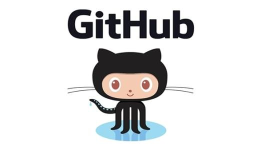

# 自我介绍

## 我叫Llane，我的爱好是 
* 看动画、电影、书
* 打游戏
* 健身

## 我的学习过的编程语言有
1. JavaScript
2. PHP
3. Java


```javascript
function f(){
  console.log('hello world')
}

f()
```

## 目前是一名前端开发，业余时间学习java


[我的github地址](https://github.com/Llane00)

